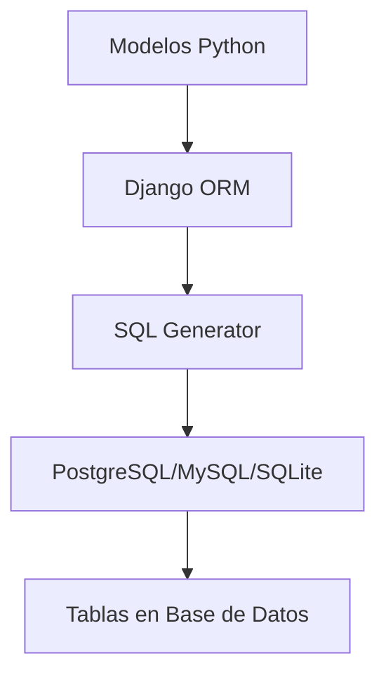

# Nota Técnica: Por qué PostgreSQL

Alejandro, esta nota explica por qué PostgreSQL es esencial para nuestro proyecto.

## Django ORM y Bases de Datos

### El ORM como Capa de Abstracción



1. **¿Qué hace el ORM?**

   ```python
   # Escribimos esto en Python
   class Producto(models.Model):
       nombre = models.CharField(max_length=100)
       precio = models.DecimalField(max_digits=10, decimal_places=2)
   ```

   ```sql
   -- Django lo convierte a SQL
   CREATE TABLE inventory_producto (
       id SERIAL PRIMARY KEY,
       nombre VARCHAR(100) NOT NULL,
       precio DECIMAL(10,2) NOT NULL
   );
   ```

2. **Ventaja del ORM:**
   - Escribimos una vez en Python
   - Funciona en cualquier base de datos
   - Maneja diferencias de SQL automáticamente

## ¿Por qué no SQLite?

### SQLite (incluido en Django)

```python
DATABASES = {
    'default': {
        'ENGINE': 'django.db.backends.sqlite3',
        'NAME': BASE_DIR / 'db.sqlite3',
    }
}
```

✅ Pros:

- No requiere instalación
- Archivo único
- Bueno para desarrollo

❌ Contras:

- Bloquea la base completa en escritura
- No soporta conexiones simultáneas
- Sin usuarios/permisos nativos
- Sin triggers robustos
- Limitado en búsquedas complejas

### PostgreSQL (nuestra elección)

```python
DATABASES = {
    'default': {
        'ENGINE': 'django.db.backends.postgresql',
        'NAME': 'mundo_cartas_db',
        # ...
    }
}
```

✅ Pros:

- Transacciones ACID robustas
- Excelente para múltiples usuarios
- Triggers y funciones avanzadas
- Búsqueda de texto completo
- Índices avanzados
- Backups en caliente
- Replicación

❌ Contras:

- Requiere instalación
- Más complejo de configurar
- Consume más recursos

## Características que Necesitamos

1. **Auditoría de Cambios**

   ```sql
   -- Esto es fácil en PostgreSQL
   CREATE TRIGGER audit_trigger
   AFTER UPDATE ON inventory_producto
   FOR EACH ROW EXECUTE FUNCTION log_cambios();
   ```

2. **Búsquedas Eficientes**

   ```sql
   -- Búsqueda de texto completo en nombres de cartas
   CREATE INDEX idx_producto_nombre_gin ON inventory_producto
   USING gin(to_tsvector('spanish', nombre));
   ```

3. **Transacciones en Ventas**
   ```python
   with transaction.atomic():
       # Actualizar inventario
       producto.stock -= cantidad
       producto.save()

       # Registrar venta
       venta = Venta.objects.create(...)

       # Si algo falla, todo se revierte automáticamente
   ```

## Escenarios Críticos

1. **Concurrencia**

   - Dos vendedores intentan vender la última carta
   - PostgreSQL maneja esto correctamente
   - SQLite podría crear race conditions

2. **Respaldos**

   - Necesitamos backup sin detener el sistema
   - PostgreSQL: `pg_dump` en caliente
   - SQLite: requiere detener la aplicación

3. **Escalabilidad**
   - Múltiples vendedores conectados
   - API y admin panel simultáneos
   - PostgreSQL maneja esto sin problema

## Conclusión

No es solo una preferencia, PostgreSQL nos da:

1. Seguridad en transacciones críticas
2. Herramientas para auditoría
3. Mejor rendimiento en producción
4. Capacidad de escalar

La inversión inicial en configuración vale la pena por la robustez y características que necesitamos para una aplicación comercial real.
